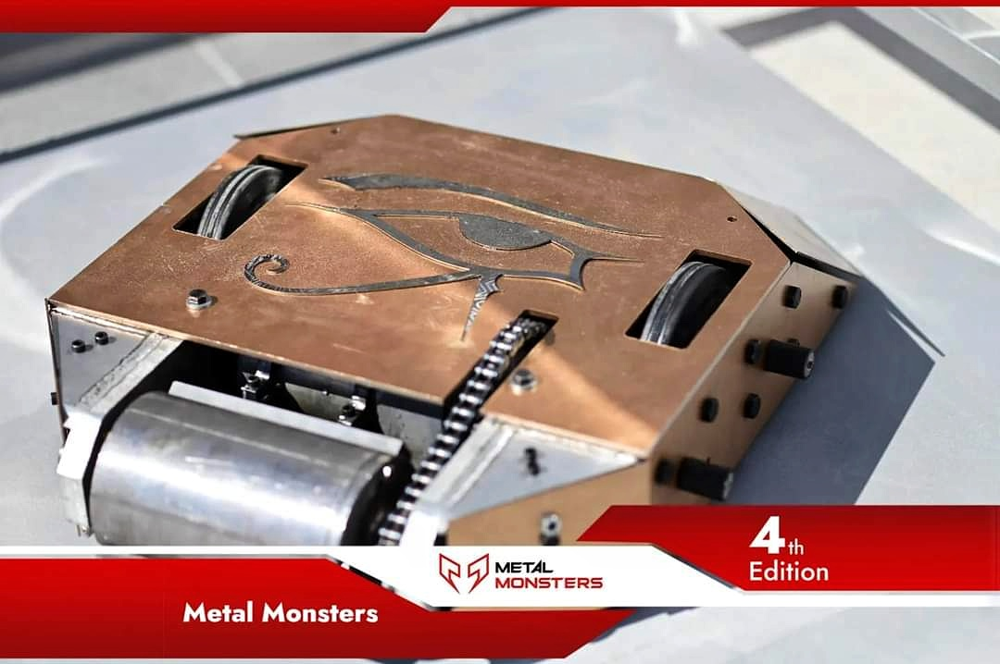
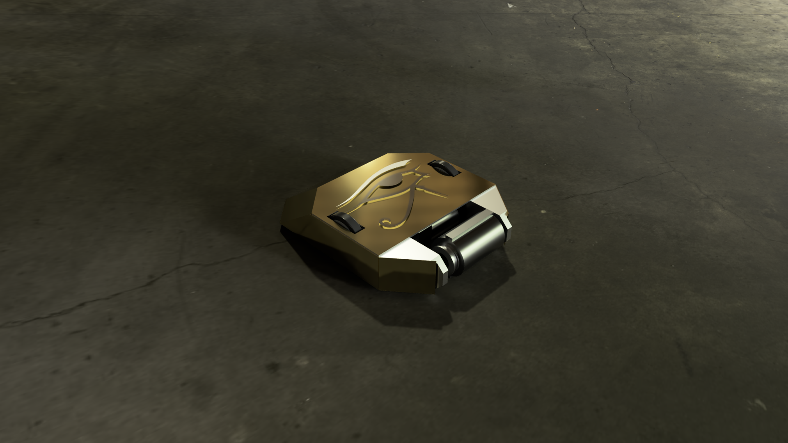
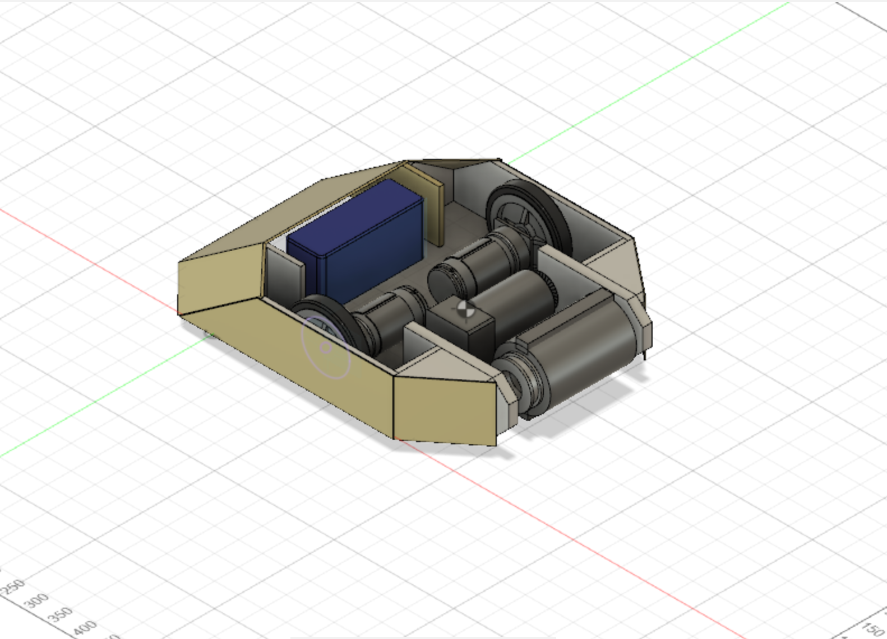

# Combat Robot - 55KG Arena Fighting Bot

This project showcases a 55KG combat robot built for national-level arena battles. It features a robust aluminum-steel chassis, a high-impact spinning drum weapon, and complete remote control using embedded systems and motor drivers.

##  Overview

- **Weight:** 55KG
- **Chassis:** Aluminum frame (20mm) reinforced with 2mm steel outer plating
- **Drive System:** 2WD
- **Weapon:** 14KG steel drum with chrome-edged blades spinning at 600 RPM

## Electronics & Control

- **Power Sources:**
  - 22V Lithium-ion Battery (Main drive)
  - 40V Lithium-ion Battery (Weapon system)
- **Controller:** Arduino Mega
- **Motor Driver:** Cytron Dual Channel Motor Driver
- **Remote Control:** RC Receiver + Transmitter

## My Contributions

- Selected and tested motors for both movement and weapon control
- Designed and implemented the full electrical circuit
- Programmed the control logic for remote navigation and weapon triggering
- Conducted system integration and live testing under battle conditions

## Achievements

- **Ranked 6th place** in a national robotics combat competition

## Skills & Technologies Used

- Embedded C / Arduino
- Electronics Design
- Robotics Control Systems
- Power Systems & Motor Control
- Problem Solving in Real-Time Robotics

<h3>Robot Front View</h3>

<h3>Robot Render</h3>

<h3>Internal components</h3>

<h3>Judging 😪</h3>

